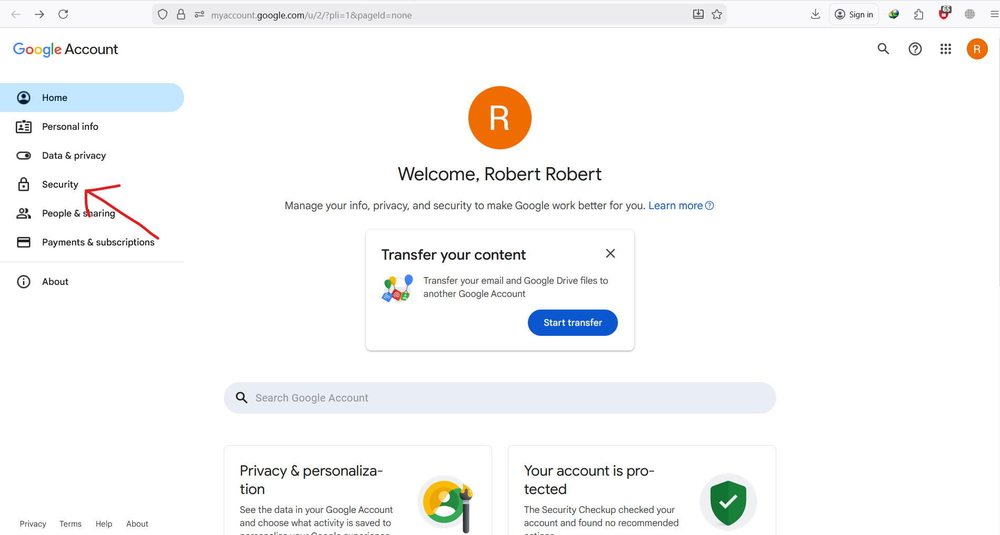
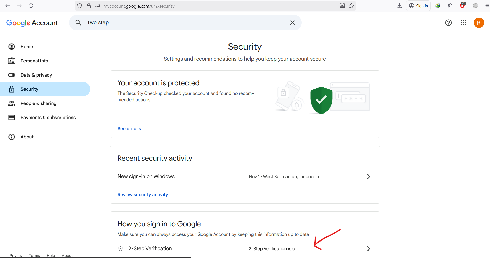
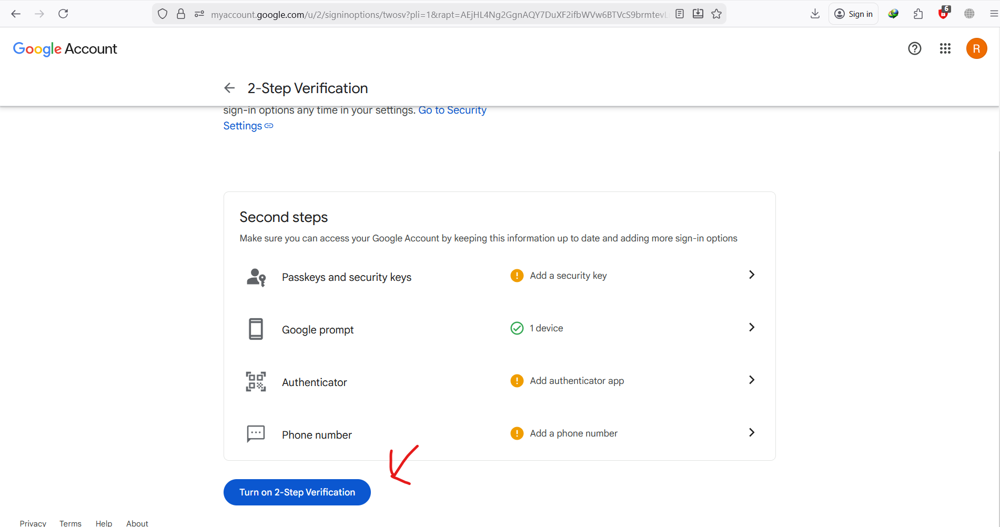
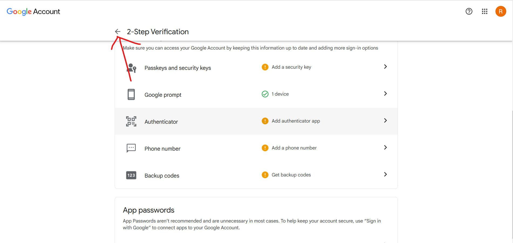
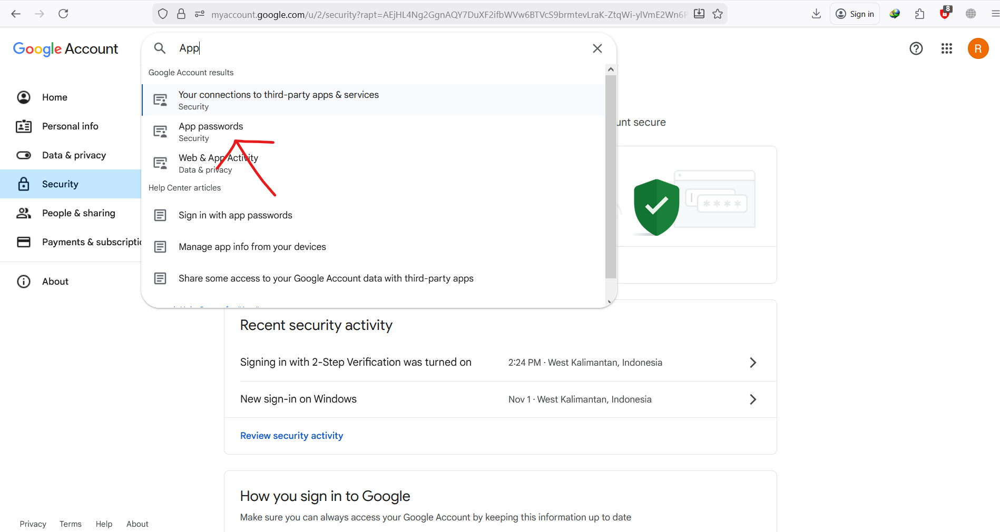
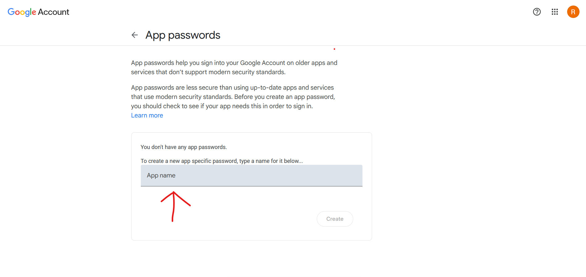
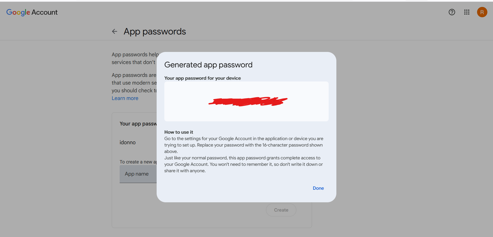
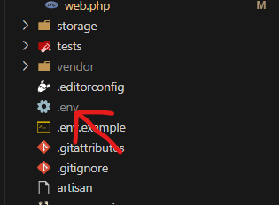
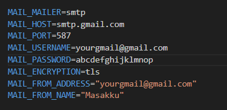

# MasakKu - Platform Resep #1 di Indonesia


MasakKu adalah Web yang cocok untuk orang orang pada saat mereka bingung mau masak apa dan mereka bisa memakai fitur filter yang dimana jika mereka mau 
atur kadar gizi dalam makanan itu mereka dapat mencarinya menggunakan filter misalnya mau banyak karbohidrat jdi mereka tinggal milih 
filter karbo dan masi ada filter lainnya lagi dan juga web kami sangat cocok jika mereka yang ingin masak tpi bingung ingin masak apa 
dengan bahan seadanya di rumah
## Fitur Utama

-   **Ribuan Resep**: Koleksi lengkap resep dari seluruh nusantara hingga internasional
-   **Filter**: Sistem Filter Yang Dapat Di Sesuaikan Dengan Kemauan User
-   **Kategori Lengkap**: Masakan Utama, Minuman, Dessert, Sea Food, Sup & Kuah, Cemilan
-   **Admin Page**: Memiliki Fitur Admin Page yang bekerja
-   **Fitur Search**: Memiliki Fitur Search Pada Admin Page Maupun User Page
-   **Fitur Chart**: Memiliki Fitur Chart Pada Dashboard admin
-   **Fitur Lupa Password**: Memiliki Fitur Lupa Password
-   **Fitur CRUD**: Memiliki Fitur CRUD Pada Admin Page dan User Profile
-   **Fitur NonAktif Menu**: Memiliki Fitur Untuk Menonaktifkan Menu Makanan Baik Secara 1 Menu Maupun Secara Category

## Instalasi

### Prasyarat

-   PHP >= 8.1
-   Composer
-   Node.js & NPM
-   MySQL

### Langkah Instalasi

1. **Clone Repository**

    ```bash
    git clone https://github.com/Trenoko/STS.git
    cd STS
    ```

2. **Install Dependencies**

    ```bash
    composer install
    npm install
    ```

3. **Setup Environment**

    ```bash
    cp .env.example .env
    php artisan key:generate
    ```

4. **Konfigurasi Database**
   Edit file `.env` dan sesuaikan konfigurasi database dengan environment lokal Anda:

    ```env
    DB_CONNECTION=mysql
    DB_HOST=127.0.0.1
    DB_PORT=3306
    DB_DATABASE=sts
    DB_USERNAME=root
    DB_PASSWORD=
    ```

5. **Konfigurasi SMTP / MAIL_MAILER**

    Aplikasi ini menggunakan email untuk verifikasi dan reset password berikut langkah langkah configurasi nya:

    
    Buka lah Google account mu dan masuk kebagian Security

    
    Masuk kedalam  2-Step Verification

    
    Nyalakan 2 Step Verification

    
    Keluar dari page 2 step verification

    
    Search App Password pada searchbar

    
    Masukkan Nama yang kamu inginkan

    
    App Password akan di buat silahkan di copy

    

    Sekarang Kembali Ke VsCode dan membuka file .env

    

    ubahlah MAIL_USERNAME dan MAIL_FROM_ADDRESS menggunakan email yang kamu gunakan untuk mendapatkan App Password
    Kemudian Paste Password yang tadi sudah di Copy pada Mail_Password dan hapus sepasi pada password

6. **Jalankan Migration dan Seeder**

    ```bash
    php artisan migrate --seed
    ```

7. **Build Assets**

    ```bash
    npm run build
    ```

8. **Jalankan Server**

    ```bash
    php artisan serve
    ```

---

## Penggunaan Singkat

1. **Registrasi & Login**

    - Pengguna baru melakukan registrasi dan verifikasi email.
    - Setelah login, pengguna diarahkan ke halaman landing resep.

2. **Jelajahi Resep**

    - Cari resep via search bar.
    - Gunakan filter kategori (Masakan Utama, Minuman, dll.).
    - Gunakan filter nutrisi sesuai kebutuhan.

3. **Favorit & Detail Resep**

    - Klik ikon hati untuk menandai resep sebagai favorit.
    - Buka detail resep untuk melihat bahan, langkah (recipe_steps), dan informasi lain.

4. **Halaman Admin**
    - Akun dengan status admin dapat masuk ke halaman `Admin Page` dari tombol khusus di header.
    - Admin dapat mengelola menu (resep) dan pengguna (aktif/nonaktif, peran admin).
    - Email Admin Adalah :admin@masakku.com
    - Password Admin Adalah:admin123

---

## Tech Stack

-   **Backend**: Laravel 10.x
-   **Frontend**: Blade Templates + Tailwind CSS
-   **Database**: MySQL
-   **Auth**: Laravel session authentication (login biasa)
-   **Icons & UI**: SVG Heroicons + aset gambar custom
-   **Tool**: ChatGpt, Gemini, Kimi AI, Youtube

---

## Struktur Proyek (Singkat)

```
STS/
├── app/
│   ├── Http/Controllers/     # Controller HTTP (Auth, Recipe, Admin, dll.)
│   ├── Models/               # Eloquent models (User, Recipe, RecipeStep, Category, ...)
├── database/
│   ├── migrations/           # Migrasi tabel
│   └── seeders/              # Seeder awal (UserSeeder, RecipeSeeder, dll.)
├── public/
│   └── images/               # Gambar (logo, icon, step-1 .. step-9, dll.)
├── resources/
│   ├── views/                # Blade templates (landing, auth, admin, dll.)
├── routes/
│   └── web.php               # Routing utama aplikasi web
```

### Skema Database (Utama)

-   **users**: data pengguna (nama, email, status, is_admin, dll.)
-   **recipes**: data resep utama
-   **recipe_steps**: langkah memasak per resep
-   **categories**: kategori resep
-   **favorites**: mapping user ke resep favorit

### Pembagian Tugas
- **Robert**: FullStack
- **Kenneth**:UI&UX Designer
- **Davin**:UI&UX Designer

---

## Kontak

-   **Email**: r03er7301@gmail.com

---

**MasakKu** - Platform Resep #1 di Indonesia
